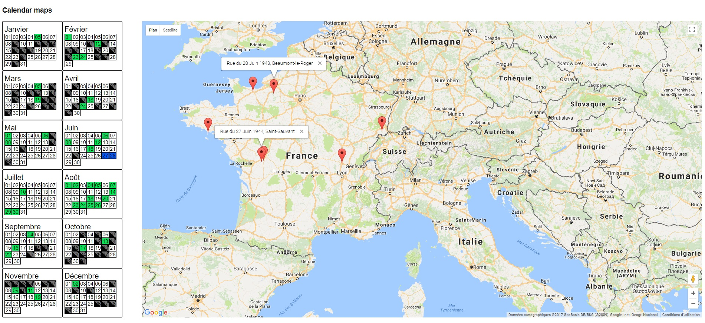

# calendar-anthony-peskine

A map to follow calendar activity.

# Installation instructions

* Download and install git on your computer : https://git-scm.com/download
* Download and install nodejs : https://nodejs.org/en/download/
* In a terminal, 
  * type : ```git clone https://github.com/vincent-ledu/calendar-anthony-peskine.git```
  * type : ```cd calendar-anthony-peskine```
  * type : ```npm install```
  * type : ```npm install pm2```
  * type : ```pm2 start index.js```
  * in your favorite browser, go to http://localhost:8080

# Screenshot

